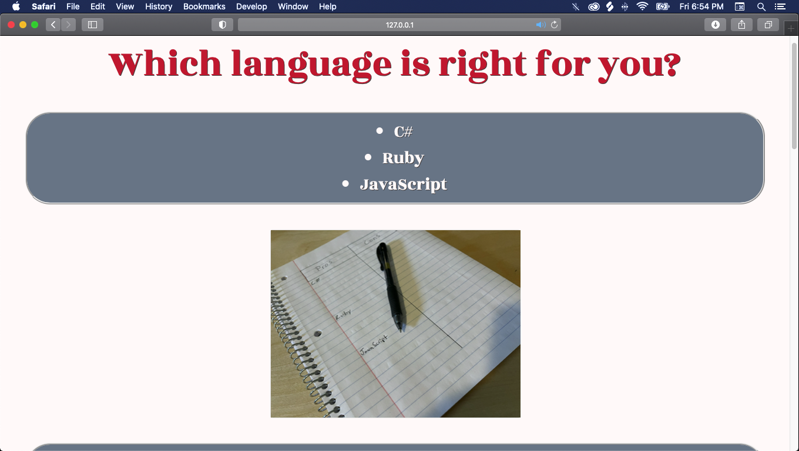

# **Programming Language Selector**

## Built to choose a programming language 

#### *By: _Alan Call_*

## Technologies Used

* HTML
* CSS
* JavaScript
* BootStrap
* Jquery
* Markdown

## Description

This website will ask a user to answer 5 basic true or false questions. Depending on the answers they input, the website will provide them 4 different outcomes.

## Setup

- Clone this repository to your desktop.

- Navigate to the top level of the directory.

- Open file index.html in your browser.

## OR

[View Here](https://alanmatthewcall.github.io/programing-language-selector/)

## Known Bugs

- No known issues

## License

[MIT](LICENSE.txt)
Copyright (c) Alan Call

## _Contact Information_

 * Alan Call alanmatthewcall@gmail.com

 
 
